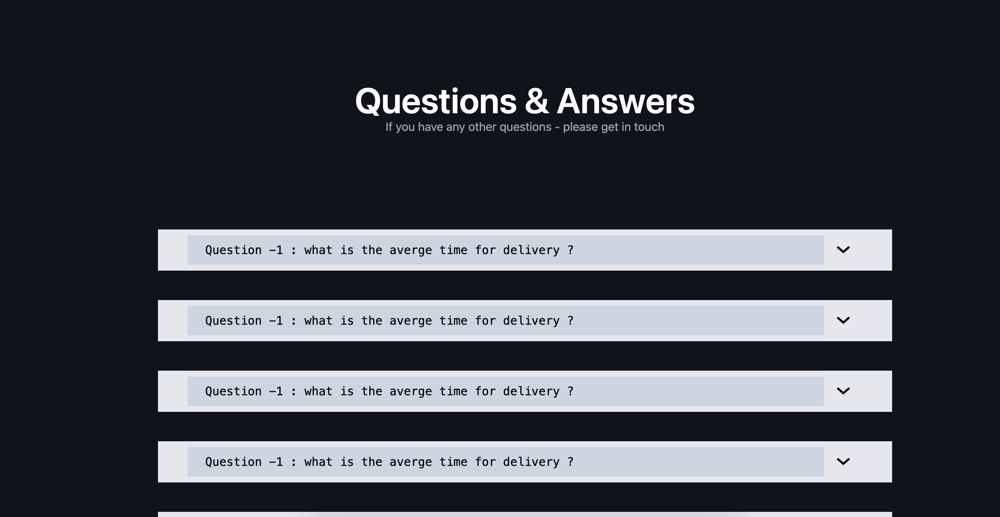

# Creative Portfolio

## PixelBloom

PixelBloom is a portfolio website for photo editing, video editing, and more.
build using creative visuals and modern animations.

**Built with**:

- [Vite](https://vitejs.dev/)
- [React](https://reactjs.org/)
- [Tailwind CSS](https://tailwindcss.com/)
- [Framer Motion](https://www.framer.com/motion/)
- [Animate on Scroll (AOS)](https://michalsnik.github.io/aos/)
- [Node.js](https://nodejs.org/)

## Screenshots

Here are some previews of the website:

###### screenshot-1


###### screenshot-2


###### screenshot-3


###### screenshot-4



###### screenshot-5


## Features

- Intuitive interface for photo and video editing.
- Smooth animations and transitions powered by Framer Motion and AOS.
- Fully responsive design built with Tailwind CSS.

## Getting Started

1. Clone the repository:

   ```bash
   git clone https://github.com/Ashish-More-02/Creative_Portfolio.git

   ```

2. move into directory and run

   ```
   cd creative_portfolio
   npm run dev
   ```
3. Open (http://localhost:5173/) to Start

## Licence

Distributed under the MIT License. See `LICENSE` for more information.
